## Creating a web portal for our company with all the security as much as possible using a Wordpress software with a dedicated database server in which Database is not accessible from the outside world for security purposes. Only the Wordpress is accessible to Clients. An additional feature has been added which is a NAT Gateway to provide the internet access to instances running in the private subnet.
### Before explanation of my task, let me introduce you to these terms.

# Virtual Private Cloud(VPC)

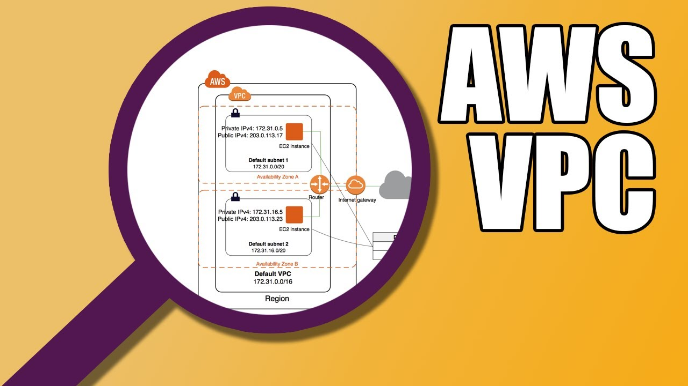

Amazon Virtual Private Cloud (VPC) allows the users to use AWS resources in a virtual network. The users can customize their virtual networking environment as they like, such as selecting own IP address range, creating subnets, and configuring route tables and network gateways. The list of AWS services that can be used with Amazon VPC are :-
1. Amazon EC2
2. Amazon Route 53
3. Amazon WorkSpaces
4. Auto Scaling
5. Elastic Load Balancing
6. AWS Data Pipeline
7. Elastic Beanstalk
8. Amazon Elastic Cache
9. Amazon EMR
10. Amazon OpsWorks
11. Amazon RDS
12. Amazon Redshift

VPC actually Provides NaaS(Network-as-a-Service). In VPC world it is known as Subnets. In AWS, VPC provides Boundary to isolate our infrastructure.

#### Note:- If our instances are running on different Data-Center but they have the same VPC, they will have high-speed Connectivity. When we create AWS Account, by default they create a VPC and three Subnets for us and launch each Subnet in each Data-Center for disaster Recovery.

# AWS Subnets

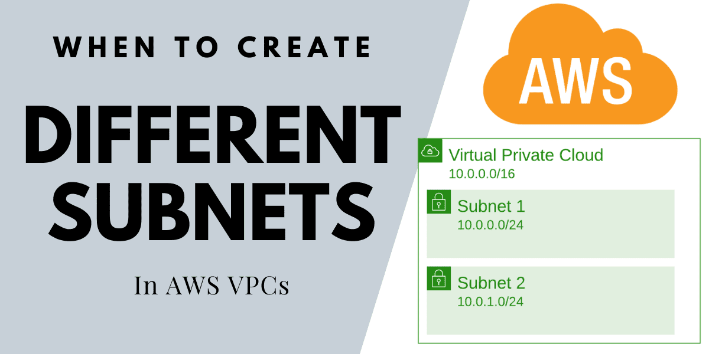

A default Subnet is a public subnet, because the main route table sends the subnet's traffic that is destined for the internet to the internet gateway. You can make a default subnet into a private subnet by removing the route from the destination 0.0.0.0/0 to the internet gateway. However, if you do this, no EC2 instance running in that subnet can access the internet.

Instances that you launch into a default subnet receive both a public IPv4 address and a private IPv4 address, and both public and private DNS hostnames. Instances that you launch into a nondefault subnet in a default VPC don't receive a public IPv4 address or a DNS hostname. You can change your subnet's default public IP addressing behavior.

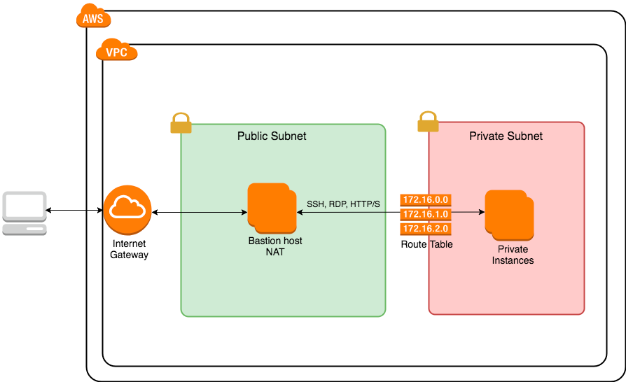

## Public Subnets
A public subnet has an outbound route that sends all traffic through what AWS calls an Internet Gateway (IGW). The IGW lets traffic — IPv4 or IPv6 — out of the VPC without any constraints on bandwidth. Instances in public subnets can also receive inbound traffic through the IGW as long as their security groups and Network-ACLs allow it.

## Private Subnets
Contrast that with a private subnet which, if it needs to talk to the internet, must do so through a NAT(Network Access Translation) gateway. NATs are really common. Run a wireless router? The router itself does network address translation. Importantly a NAT won’t allow inbound traffic from the internet — that’s what makes a private subnet, well, private.

So what's the difference between Public Subnet and Private Subnet?

A <strong> public subnet </strong> has a route table that says, “send all outbound traffic (anything to the CIDR block 0.0.0.0/0) via this internet gateway.” A <strong> private subnet </strong> either does not allow outbound traffic to the internet or has a route that says, “send all outbound traffic via this NAT gateway.”

It’s important to note that all subnets in a VPC can talk to one another as long as the host’s security groups allow it. There’s always a route that says “keep traffic to {YourVPCsCIDRblock} inside the VPC.”

### What is a Gateway and What Does it Do?

A gateway is a node (router) in a computer network, a key stopping point for data on its way to or from other networks. Thanks to gateways, we are able to communicate and send data back and forth. The Internet wouldn't be any use to us without gateways (as well as a lot of other hardware and software).

# Elastic IP

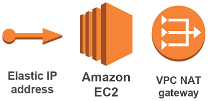

An Elastic IP address is a static, public IPv4 address designed for dynamic cloud computing. We can associate an Elastic IP address with any instance or network interface for any VPC in your account. With an Elastic IP address, we can mask the failure of an instance by rapidly remapping the address to another instance in your VPC. Note that the advantage of associating the Elastic IP address with the network interface instead of directly with the instance is that you can move all the attributes of the network interface from one instance to another in a single step.

# NAT Gateway

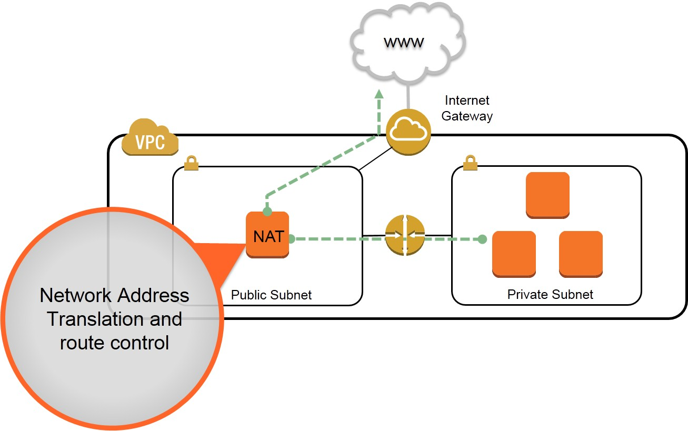

We use a Network Address Translation (NAT) gateway to enable instances in a private subnet to connect to the internet or other AWS services, but prevent the internet from initiating a connection with those instances.
NAT Gateway is a highly available AWS managed service that makes it easy to connect to the Internet from instances within a private subnet in an Amazon Virtual Private Cloud (Amazon VPC). Previously, you needed to launch a NAT instance to enable NAT for instances in a private subnet. 

Lets start with our Task Number 4. The Objectives are:-
1.  Write an Infrastructure as code using terraform, which automatically create a VPC.
2.  In that VPC we have to create 2 subnets:
    1.   public  subnet [ Accessible for Public World! ] 
    2.   private subnet [ Restricted for Public World! ]
3. Create a public facing internet gateway for connect our VPC/Network to the internet world and attach this gateway to our VPC.
4. Create  a routing table for Internet gateway so that instance can connect to outside world, update and associate it with public subnet.
5.  Create a NAT gateway for connect our VPC/Network to the internet world  and attach this gateway to our VPC in the public network
6.  Update the routing table of the private subnet, so that to access the internet it uses the nat gateway created in the public subnet
7.  Launch an ec2 instance which has Wordpress setup already having the security group allowing  port 80 so that our client can connect to our wordpress site. Also attach the key to instance for further login into it.
8.  Launch an ec2 instance which has MYSQL setup already with security group allowing  port 3306 in private subnet so that our wordpress VM can connect with the same. Also attach the key with the same.

Note: Wordpress instance has to be part of public subnet so that our client can connect our site. 
mysql instance has to be part of private  subnet so that outside world can't connect to it.

So Let's Start

1. Choose the Provider whom Terraform will contact. In my case it is AWS
>provider "aws" {             
>  region  = "ap-south-1"     
>  profile = "Zulu"           
>}                            

2. Create IaaS code for terraform that will create a VPC for you. Now we have to create two subnets inside our VPC.

>resource "aws_vpc" "main" {             
>  cidr_block       = "192.168.0.0/16"   
>  instance_tenancy = "default"          
>
>  tags = {                                 
>    Name = "Nirbhay-VPC"                
>  }                                     
>}                                       

3. Create a public Subnet that will be accessible to the public World.

>resource "aws_subnet" "subnet1" {          
>  vpc_id     = "${aws_vpc.main.id}"        
>  cidr_block = "192.168.1.0/24"            
>  map_public_ip_on_launch = true           
>  availability_zone = "ap-south-1a"        
>  tags = {                                 
>    Name = "Nirbhay-Subnet_Public-1a"      
>  }                                        
>}                                          

4. Create a private Subnet that will be restricted for the access to the public world.

>resource "aws_subnet" "subnet2" {            
>  vpc_id     = "${aws_vpc.main.id}"          
>  cidr_block = "192.168.2.0/24"              
>  availability_zone = "ap-south-1a"          
>  tags = {                                   
>    Name = "Nirbhay-Subnet_Private-1b"       
>  }                                          
>}                                            

5. Create an Internet Gateway for our VPC so that it can be connected to the outside World.

>resource "aws_internet_gateway" "gw" {      
>  vpc_id = "${aws_vpc.main.id}"             
>  tags = {                                  
>    Name = "Nirbhay-Gateway"                
>  }                                         
>}                                           

6. Create a Route Table for our VPC so that our instances could connect to the outside world.

>resource "aws_route_table" "rt" {                    
>  vpc_id = "${aws_vpc.main.id}"                      
>  route {                                            
>    cidr_block = "0.0.0.0/0"                         
>    gateway_id = "${aws_internet_gateway.gw.id}"     
>  }                                                  
>  tags = {                                           
>    Name = "Nirbhay-pubic-rt"                        
>  }                                                  
>}                                                    

7. Associate your Route Table with Public Subnet.   

>resource "aws_route_table_association" "subnet_association" {   
>  subnet_id      = aws_subnet.subnet1.id                        
>  route_table_id = aws_route_table.rt.id                        
>}                                                               

8. After Route Table create one Elastic IP for NAT gateway inside VPC which gives one public static IP to the NAT Gateway.

>resource "aws_eip" "gateway_eip" {                
>  vpc = true                                      
>  depends_on = ["aws_internet_gateway.gw"]        
>}                                                 

9. Now Create a NAT gateway so that VPC is connected to the internet world. Also Attach this gateway to the VPC in the public network

>resource "aws_nat_gateway" "ngw" {                 
>  allocation_id = "${aws_eip.gateway_eip.id}"      
>  subnet_id     = aws_subnet.subnet1.id            
>  depends_on = ["aws_internet_gateway.gw"]         
>}                                                  

10.Create a Route table for private subnet for the NAT Gateway to access the internet such that  it uses the nat gateway created in the public subnet

>resource "aws_route_table" "rt2" {                   
>  vpc_id = "${aws_vpc.main.id}"                      
>  route {                                            
>    cidr_block = "0.0.0.0/0"                         
>    nat_gateway_id = "${aws_nat_gateway.ngw.id}"     
>  }                                                  
>  tags = {                                           
>    Name = "Nirbhay-nrt"                             
>  }                                                  
>}                                                    

11. Associate the Routing table to the private subnet only.

>resource "aws_route_table_association" "subnet_association2" {    
>  subnet_id      = aws_subnet.subnet2.id                          
>  route_table_id = aws_route_table.rt2.id                         
>}                                                                 

12.  Create a Security Group allowing Port 80 so that our client can connect to Wordpress and allowing port 22 so that our client can do SSH.

>resource "aws_security_group" "sg_webserver" {      
>  name        = "Security_group_for_Wordpress"      
>  description = "Allow ssh and httpd"               
>  vpc_id      = "${aws_vpc.main.id}"                
>  ingress {                                         
>    description = "SSH Port"                        
>    from_port   = 22                                
>    to_port     = 22                                
>    protocol    = "tcp"                             
>    cidr_blocks = ["0.0.0.0/0"]                     
>  }                                                 
>   ingress {                                        
>    description = "HTTPD Port"                      
>    from_port   = 80                                
>    to_port     = 80                                
>    protocol    = "tcp"                             
>    cidr_blocks = ["0.0.0.0/0"]                     
>  }                                                 
>  egress {                                          
>    from_port   = 0                                 
>    to_port     = 0                                 
>    protocol    = "-1"                              
>    cidr_blocks = ["0.0.0.0/0"]                     
>  }                                                 
>  tags = {                                          
>    Name = "Nirbhay_sg1"                            
>  }                                                 
>}                                                   

13. Create a Security Group allowing Port 3306 so that our wordpress can connect to MySQL.

>resource "aws_security_group" "sg_database" {       
>  name        = "for_MYSQL"                         
>  description = "Allow MySQL"                       
>  vpc_id      = "${aws_vpc.main.id}"                
>  ingress {                                         
>    description = "MySQL"                           
>    from_port   = 3306                              
>    to_port     = 3306                              
>    protocol    = "tcp"                             
>  }                                                 
>  egress {                                          
>    from_port   = 0                                 
>    to_port     = 0                                 
>    protocol    = "-1"                              
>    cidr_blocks = ["0.0.0.0/0"]                     
>  }                                                         
>  tags = {                                          
>    Name = "Nirbhay_sg2"                            
>  }                                                 
>}                                                   

14. Create a Key-Pair for our Instances or use already created key-pair. Here i created the Key with RSA Algorithm which Encrypt our data.

>resource "tls_private_key" "key-pair" {                             
>  algorithm = "RSA"                                                 
>  rsa_bits = 4096                                                   
>}                                                                   
                                                                    
>resource "local_file" "private-key"{                                
>content = tls_private_key.key-pair.private_key_pem                  
>filename = "${var.ssh_key_name}.pem"                                
>file_permission = "0400"                                            
>}                                                                   
>                 
>resource "aws_key_pair" "deployer" {                                
>  key_name   = var.ssh_key_name                                     
>  public_key = tls_private_key.key-pair.public_key_openssh          
>}                                                                   

15. Launch an EC2 instance that has already wordpress in it and attach it with the security group having enabled port 80 so that our clients could connect it.

>resource "aws_instance" "web" {                                           
>  ami           = "ami-000cbce3e1b899ebd"                                 
>  instance_type = "t2.micro"                                              
>  availability_zone = "ap-south-1a"                                       
>  subnet_id      = "${aws_subnet.subnet1.id}"                             
>  associate_public_ip_address = true                                      
>  key_name = "${var.ssh_key_name}"                                        
>  vpc_security_group_ids = ["${aws_security_group.sg_webserver.id}"]      
>               
>  tags = {                                                                
>    Name = "NirbhayOS-wordpress"                                          
>  }                                                                       
>}                                                                         

16. Launch an EC2 instance that has already MySQL in it and attach it with the security group having enabled port 3306 so that our wordpress could connect to it.

>resource "aws_instance" "Mysql-OS" {                                      
>  ami           = "ami-0019ac6129392a0f2"                                 
>  availability_zone = "ap-south-1a"                                       
>  instance_type = "t2.micro"                                              
>  subnet_id      = "${aws_subnet.subnet2.id}"                             
>  key_name = "${var.ssh_key_name}"                                        
>  vpc_security_group_ids = ["${aws_security_group.sg_database.id}"]       
> 
>  tags = {                                                                
>    Name = "NirbhayOS-mysql"                                              
>  }                                                                       
>}                                                                         

17. For testing purpose you can create null resource and checking the SSH and Public IPs and getting the Public IPs and configuring our Apache Server.

>resource "null_resource" "nullremote1" {                                
>  connection {                                                          
>    type = "ssh"                                                        
>    user = "bitnami"                                                    
>    host = aws_instance.web.public_ip                                   
>    private_key = file("${var.ssh_key_name}.pem")                       
>  }                                                                     
>
>  provisioner "remote-exec" {                                            
>    inline = [                                                           
>      "sudo /opt/bitnami/ctlscript.sh restart apache",                   
>      "sudo /opt/bitnami/ctlscript.sh status",                                                   
>    ]                                                                    
>  }                                                                       
>}                                                                        

Now before running this file, I will show you that i have no instances running.

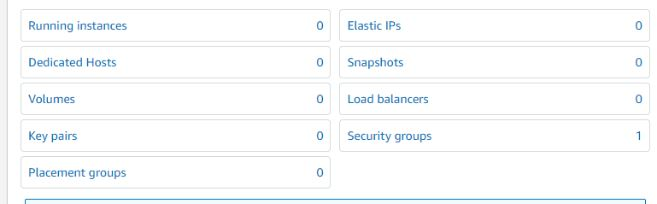

I have no Subnets and VPC created. 

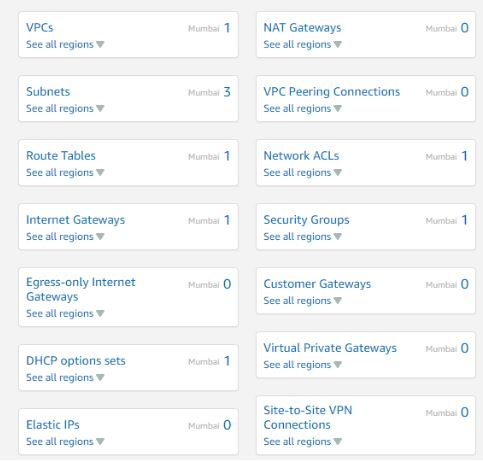

Now let us run the terraform code by downloading the plugins using the Terraform init command and Running the code using Terraform apply command.
If everything is correct, the terraform code will run successfully. After successful run you will notice that the VPC has now been created.

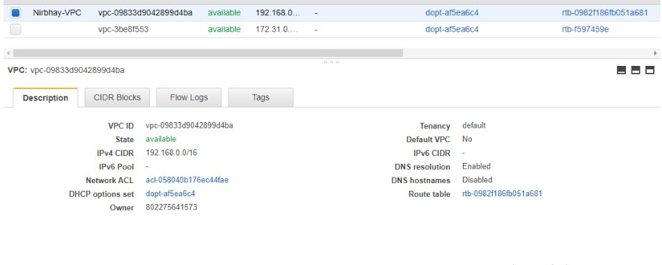

Public and Private subnets have been created.

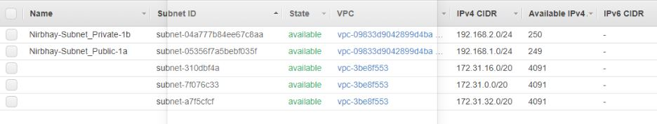

Route Table has been created.

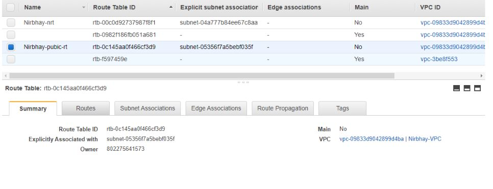

In edit route tables you will notice we have allowed all the traffics through our Internet Gateway.

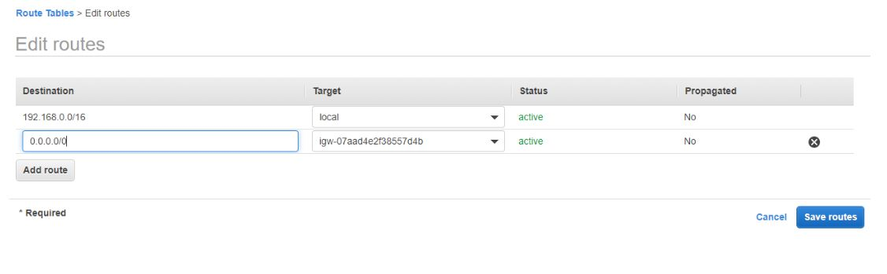

We have associated our subnets with the route table.

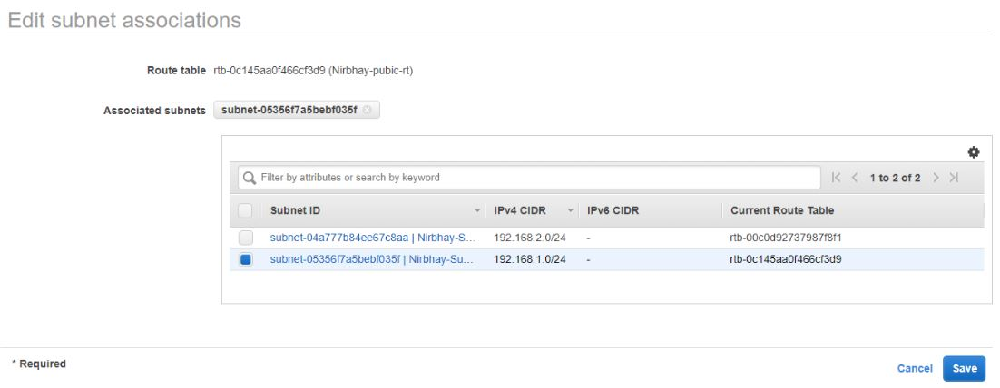

We have attached our Gateway with the respective VPC

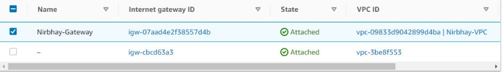

We have created one Elastic IP.

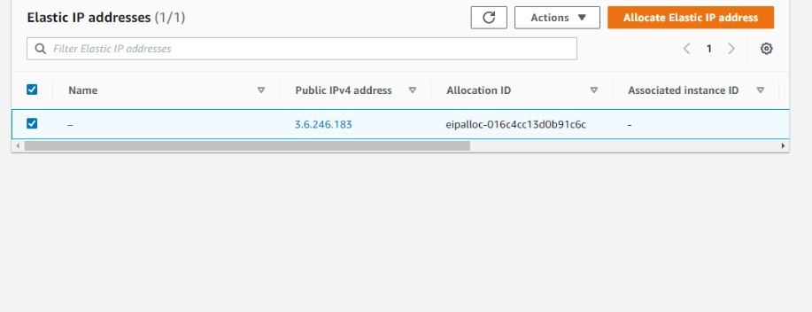

We have created a NAT Gateway too.

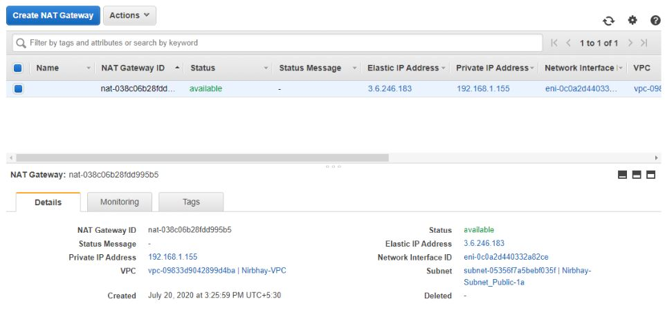

And launched two instances namely, OS and Wordpress.

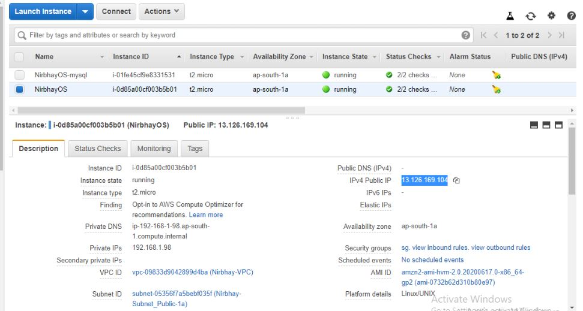

Now for testing purpose, copy the IP of the wordpress for ssh.

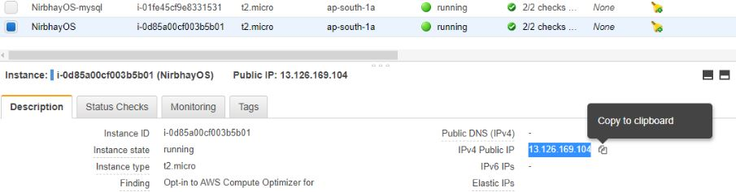

login to the ssh. You will be now inside your wordpress OS. You can check your IP by using the ifocnfig command.

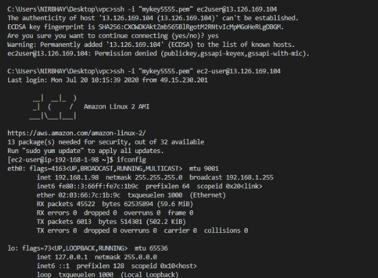

You can ping google now.

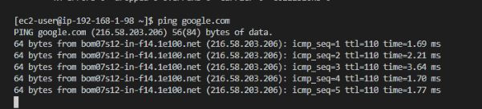

You can retrieve your current IP through which the data is transmitted by using the ipecho command mentioned below.

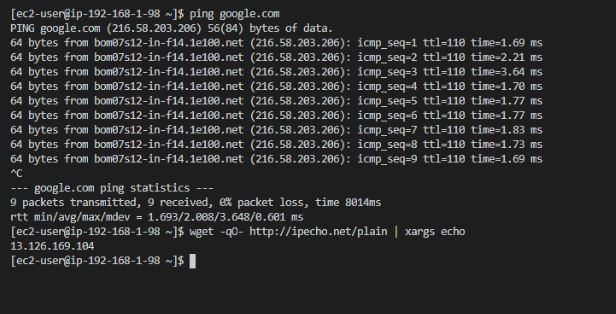

Now copy the ssh of MySQL.

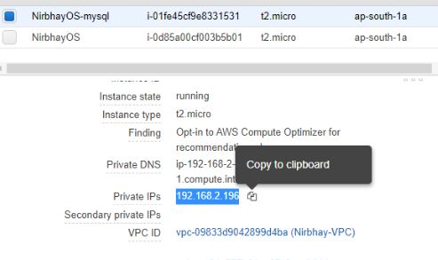

Login to the ssh and ping google.

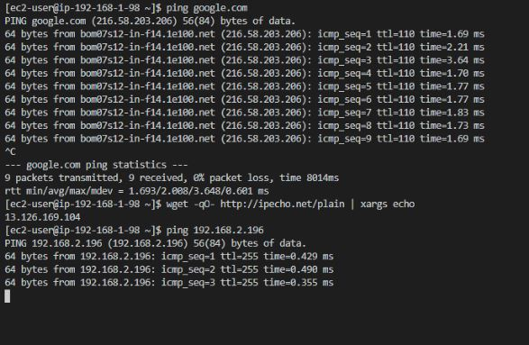

Now open the key.pem file which you have attached to your OS.

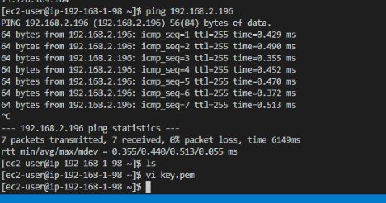

This is your key file with RSA Algorithm.

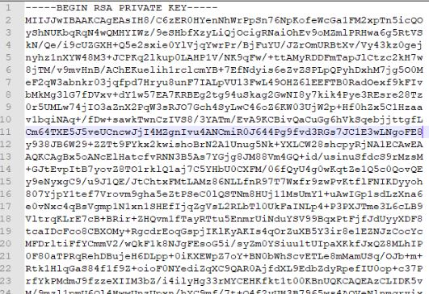

Paste the key in the file that will encrypt our data which will convert this key to the readable format only for those which have the access.

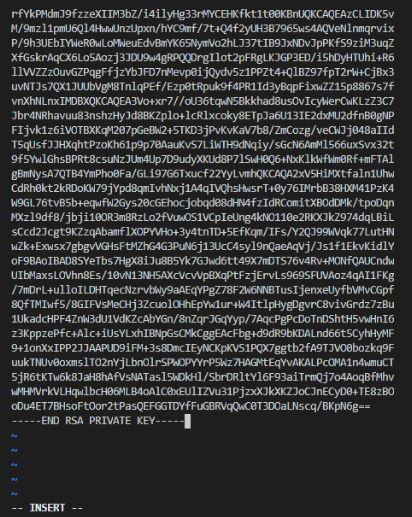

Now do ssh from the MySql to your wordpress. You will be able to go inside of it.

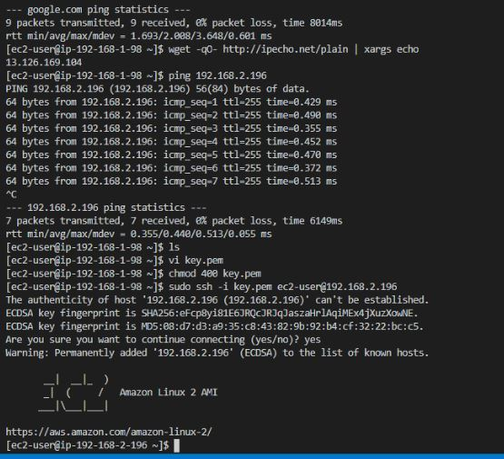

You will be able to ping google and retrieve the IP but none of the outsiders will be able to connect to your MySQL OS.

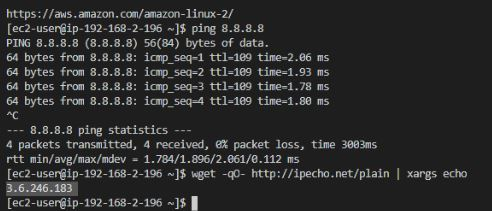

Now copy the Public IP of the OS and paste it on your web browser. You will notice our required target has been setup and the output has comeup.

So this finishes our required Task. If you have any queries regarding this , feel free to contact me or you can even mail me at:- nirbhaymaitra684@gmail.com
